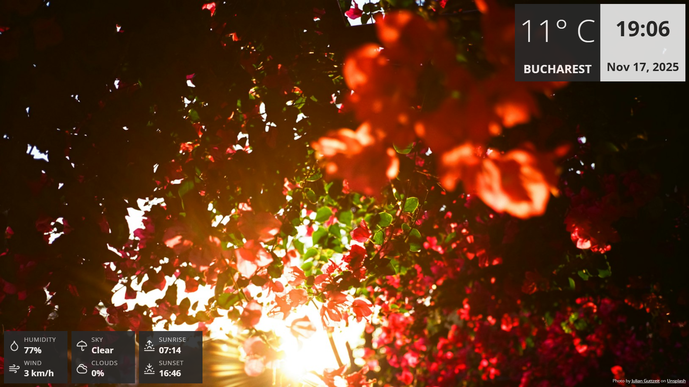

# 🌅 Raspberry Pi Dashboard

A beautiful, fullscreen dashboard application built with Tauri that displays the time, date, weather, and stunning contextual background images from Unsplash. Perfect for Raspberry Pi displays, smart mirrors, or any always-on display setup.

## ✨ Features

### 🖼️ **Smart Background Images**
- **Seasonal Awareness**: Automatically adjusts photos based on spring, summer, autumn, or winter
- **Holiday Themes**: Special imagery for Christmas, New Year, Halloween, and Easter
- **Time-Based Moods**: 
  - Dawn : Moody, atmospheric sunrise photos
  - Day : Bright, vibrant landscapes
  - Dusk : Golden hour, sunset vibes
  - Night : Dark, moody nightscapes
- **Weather Integration**: Shows cozy rain or snow photos when it's raining or snowing
- **Powered by Unsplash**: High-quality, curated photography

### 🌤️ **Real-Time Information**
- **Live Clock**: Updates every second with HH:MM format
- **Current Date**: Clean, readable date display
- **Local Weather**: Real-time temperature in Celsius
- **Auto-Location**: Automatically detects your location via IP

### 🚀 **Performance**
- **Built with Tauri**: Native performance with minimal resource usage
- **Rust Backend**: Lightning-fast API calls and data processing
- **Fullscreen Mode**: Immersive, distraction-free display

## 🛠️ Technologies

- **[Tauri v2](https://tauri.app/)**: Cross-platform desktop framework
- **Rust**: Backend logic and API integration
- **JavaScript**: Frontend interactivity
- **HTML/CSS**: Clean, modern UI
- **APIs**:
  - [Unsplash API](https://unsplash.com/developers): Background images
  - [Open-Meteo](https://open-meteo.com/): Weather data
  - [IP-API](http://ip-api.com/): Geolocation

## 📸 Screenshots

The dashboard displays:
- Large, clear time display
- Current date
- Local weather with temperature
- Your city/location
- Beautiful, context-aware background images
- Photo credit to Unsplash photographers

## 🤝 Contributing

Contributions are welcome! Feel free to:
- Report bugs
- Suggest new features
- Submit pull requests

## 📄 License

This project is open source and available under the MIT License.

## 🙏 Credits

- Background images from [Unsplash](https://unsplash.com/)
- Weather data from [Open-Meteo](https://open-meteo.com/)
- Built with [Tauri](https://tauri.app/)

---

**Made with ❤️ for Raspberry Pi enthusiasts**
